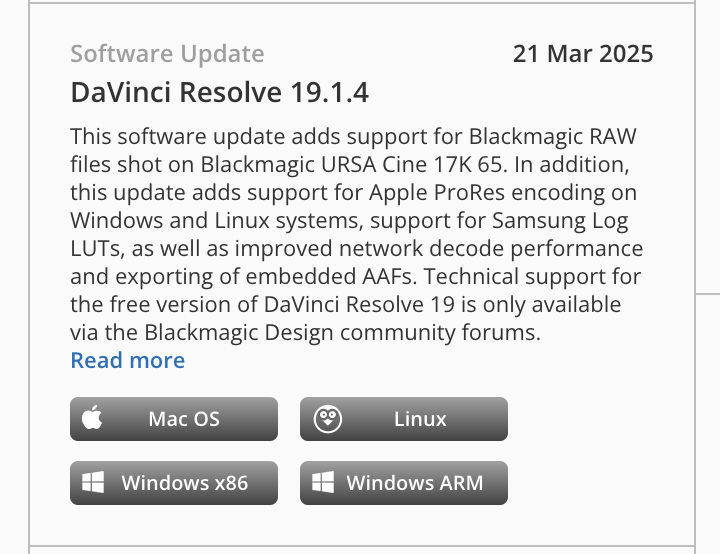

# Download the tested Resolve version: 19.1.4 Free

For the setup documented here, choose **DaVinci Resolve 19.1.4** from Blackmagic Design's official download archive. The workflow was tested with the **Free edition on macOS, build 19.1.4.11**. The download card shows **19.1.4**; the installed build includes the final `.11`.

## Find the correct download

1. Open the [Blackmagic Design Support Center](https://www.blackmagicdesign.com/support/).
2. Under **Select a Product Family**, choose the **DaVinci Resolve** family (currently labeled **DaVinci Resolve and Fairlight Live**).
3. Scroll down to **Latest Downloads**, then scroll within that download list to the older releases. Continue back to **21 March 2025**. The current release at the top may be much newer.
4. Find the card titled exactly **DaVinci Resolve 19.1.4**, dated **21 Mar 2025**, matching the screenshot below. The Free edition's title does **not** include **Studio**. A separate **DaVinci Resolve Studio 19.1.4** entry is the paid edition.
5. Click **Mac OS** on that exact card for this macOS workflow. The other buttons are for Linux, Windows x86 and Windows ARM; those platforms have not been verified with this package's macOS menu installer.
6. Follow Blackmagic's download/registration prompts. Use **Read more** on the card to review that release's installation notes and system requirements, then download the installer from Blackmagic.

If browser Find (`⌘F`) does not locate `19.1.4`, continue scrolling the **Latest Downloads** list: older entries may not yet be loaded or searchable. Use the title and date together, rather than the card's position. Page layout and product-family labels can change.

## Match this card

*User-supplied screenshot of the official Support Center, supplied September 14, 2026. Choose the **Mac OS** button under **DaVinci Resolve 19.1.4**. Screenshot content belongs to Blackmagic Design; it is an identification aid, not an installer or a separately licensed MIT asset.*

## Install and confirm

Open the downloaded archive/disk image as appropriate and follow the included macOS installer instructions. Launch Resolve, then open **DaVinci Resolve → About DaVinci Resolve** and confirm **19.1.4**, **Build 11** (the scripting audit reports `19.1.4.11`). The product should be **DaVinci Resolve** for the Free workflow. A Studio installation is a different edition and needs its own capability check.

If you already have projects in another Resolve version, save recoverable backups and consult Blackmagic's migration notes before replacing that installation; do not assume a project library upgraded by a newer release will open in 19.1.4. This guide identifies our tested setup rather than recommending a downgrade of an existing working system.

Once the version is confirmed, continue with [Resolve 19.1 skill installation and the read-only audit](resolve-19.1-quickstart.md#install-and-inspect).

## Why this exact version?

**19.1.4 Free on macOS** is the environment we exercised for internal Lua, the Scripts menu, editable timelines and native exports. Other 19.1 patch versions and newer major releases may behave differently. Installing this version does not enable Studio-only external scripting, and matching the version does not replace the initial capability audit.

We link to the official [Support Center](https://www.blackmagicdesign.com/support/) rather than a temporary installer URL or third-party mirror. The screenshot and release date help locate the same entry as the archive grows.
